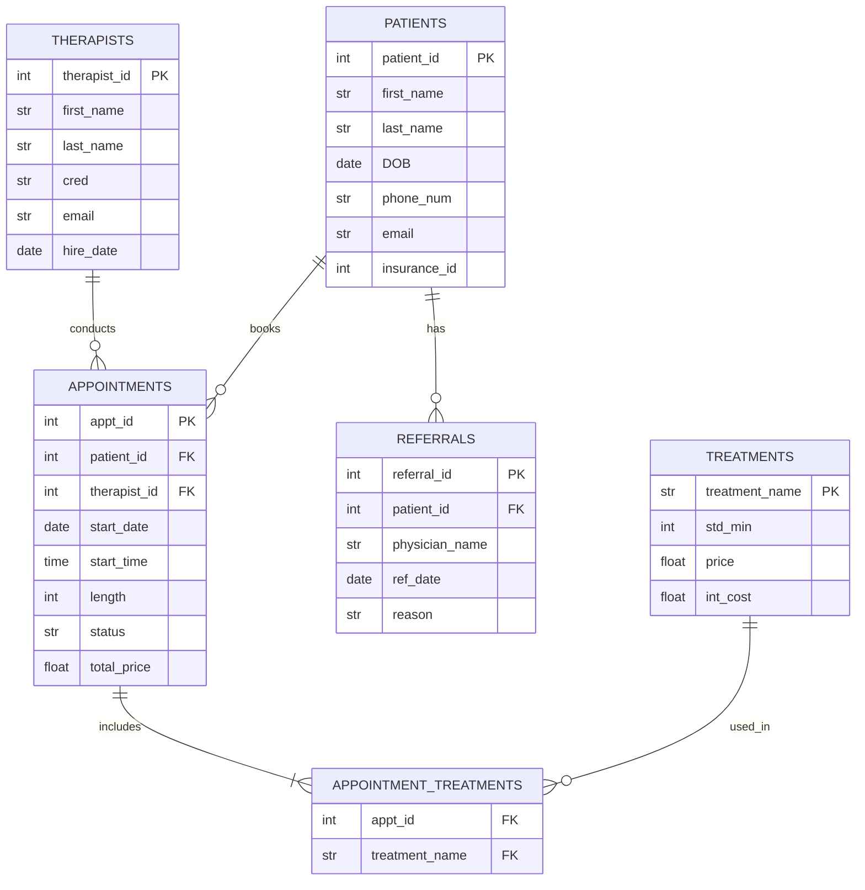

1. The Scenario: Scenario D, Babson PT Clinic 

2. The ERD: 

```mermaid
erDiagram
    THERAPISTS ||--o{ APPOINTMENTS : conducts
    PATIENTS ||--o{ APPOINTMENTS : books
    PATIENTS ||--o{ REFERRALS : has
    APPOINTMENTS ||--|{ APPOINTMENT_TREATMENTS : includes
    TREATMENTS ||--o{ APPOINTMENT_TREATMENTS : used_in

    TREATMENTS {
        str treatment_name PK
        int std_min
        float price
        float int_cost
    }

    THERAPISTS {
        int therapist_id PK
        str first_name
        str last_name
        str cred
        str email
        date hire_date
    }

    PATIENTS {
        int patient_id PK
        str first_name
        str last_name
        date DOB
        str phone_num
        str email
        int insurance_id
    }

    APPOINTMENTS {
        int appt_id PK
        int patient_id FK
        int therapist_id FK
        date start_date
        time start_time
        int length
        str status
        float total_price
    }

    APPOINTMENT_TREATMENTS {
        int appt_id FK
        str treatment_name FK
    }

    REFERRALS {
        int referral_id PK
        int patient_id FK
        str physician_name
        date ref_date
        str reason
    }
```

3. What one row means: 

4. Design Choices. 